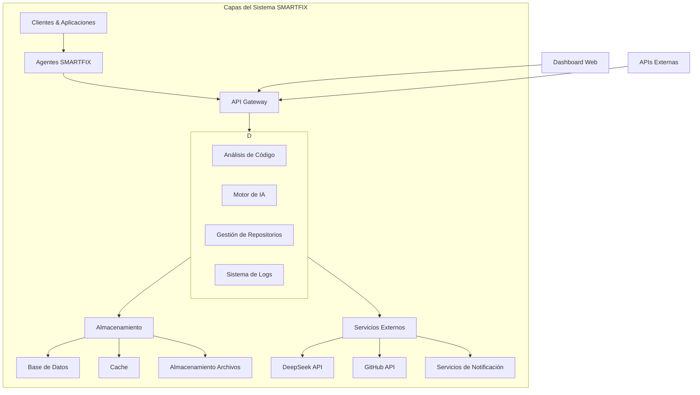

## 🚀 Instalación y Ejecución

Sigue estos pasos para iniciar el proyecto:

```sh
# Clonar el repositorio
git clone https://github.com/sjhallo07/smartfix-tool-enforcement.git
cd smartfix-tool-enforcement

# Instalar dependencias
./scripts/install.sh

# Configurar variables de entorno
cp .env.example .env
# Edita .env con tus configuraciones personales

# Ejecutar en modo desarrollo
npm run dev
```
# smartfix-tool-enforcement
sistema de detección auto reparación inteligente con ML
SMARTFIX - Sistema Inteligente de Auto-Reparación de Código
📋 Descripción del Proyecto
SMARTFIX es un sistema avanzado de auto-reparación de código que utiliza inteligencia artificial para detectar, diagnosticar y corregir errores en aplicaciones software de manera automática. El sistema integra capacidades de análisis estático y dinámico, machine learning y procesamiento de lenguaje natural para ofrecer soluciones precisas con intervención humana mínima.

Autor: Marcos Mora
Copyright: © 2024 Marcos Mora. Todos los derechos reservados bajo las leyes de la República Bolivariana de Venezuela.

🚫 Licencia y Protección
SMARTFIX es un software propietario protegido por:

Ley venezolana de Propiedad Intelectual (LOPPI)

Tratados internacionales de derecho de autor

Secreto comercial y know-how protegido

Proceso de patente internacional en curso

Queda estrictamente prohibido:

La distribución no autorizada

La ingeniería inversia

El uso no licenciado

La modificación no autorizada

🔍 Casos de Uso
1. Detección y Corrección Automática de Errores
Identificación de bugs en tiempo real

Corrección automática con aprobación humana

Soporte para múltiples lenguajes de programación

2. Gestión Inteligente de Forks de GitHub
Análisis automático de código en repositorios fork

Mejora de código con mantenimiento de compatibilidad

Generación automática de Pull Requests

3. Monitoreo Continuo de Aplicaciones
Detección proactiva de problemas

Análisis de rendimiento y calidad de código

Alertas inteligentes con priorización

4. Documentación Automatizada
Generación de changelogs detallados

Documentación de cambios y mejoras

Reportes de cumplimiento y auditoría

🏗️ Arquitectura del Sistema
Diagram
Code
graph TB
    subgraph "Capas del Sistema SMARTFIX"
        A[Clientes & Aplicaciones] --> B[Agentes SMARTFIX]
        B --> C[API Gateway]
        C --> D[Servicios Core]
        
        subgraph D
            D1[Análisis de Código]
            D2[Motor de IA]
            D3[Gestión de Repositorios]
            D4[Sistema de Logs]
        end
        
        D --> E[Almacenamiento]
        E --> E1[Base de Datos]
        E --> E2[Cache]
        E --> E3[Almacenamiento Archivos]
        
        D --> F[Servicios Externos]
        F --> F1[DeepSeek API]
        F --> F2[GitHub API]
        F --> F3[Servicios de Notificación]
    end
    
    G[Dashboard Web] --> C
    H[APIs Externas] --> C


💻 Lenguajes y Tecnologías
Lenguajes Soportados Inicialmente
Python 3.9+: Análisis estático, scripting y backend

JavaScript/TypeScript: Aplicaciones web y Node.js

Java: Aplicaciones empresariales y Android

Go: Componentes de alto rendimiento y sistemas

PHP: Aplicaciones web tradicionales

Frameworks y Librerías Principales
Python
Django: Framework web full-stack

Flask: Microframework web

FastAPI: Framework para APIs modernas

Pandas: Análisis y manipulación de datos

NumPy: Computación científica

SciKit-Learn: Machine learning

PyTorch/TensorFlow: Deep learning

JavaScript/Node.js
Express.js: Framework web para Node.js

React: Biblioteca para interfaces de usuario

Vue.js: Framework progresivo

Angular: Platforma para aplicaciones web

NestJS: Framework para aplicaciones server-side

Java
Spring Boot: Framework para aplicaciones empresariales

Hibernate: ORM para persistencia de datos

Maven/Gradle: Sistemas de build y dependencias

Escalabilidad a Otros Lenguajes
El sistema está diseñado para expandirse a:

C/C++: Aplicaciones de sistema y rendimiento crítico

C#: Desarrollo .NET y Unity

Ruby: Aplicaciones web con Ruby on Rails

Rust: Sistemas seguros y concurrentes

Kotlin: Desarrollo Android y aplicaciones modernas

Swift: Desarrollo iOS y macOS

🔄 Metodología de Desarrollo (SDLC Ágil IBM)
SMARTFIX sigue el marco de desarrollo SDLC Ágil de IBM, que combina las mejores prácticas de desarrollo ágil con los rigurosos controles de calidad de IBM.

Principios del SDLC Ágil de IBM:
Desarrollo Iterativo e Incremental

Colaboración Continua

Pruebas Integradas desde el Inicio

Gestión de Riesgos Proactiva

Calidad Integrada en cada Fase

Estrategia PaaS/CaaS para la Fase Actual
En la fase actual de desarrollo (Alpha), SMARTFIX utiliza una combinación de:

Plataforma como Servicio (PaaS) - IBM Cloud Code Engine
Despliegue gestionado de aplicaciones

Escalado automático basado en carga

Integración continua/despliegue continuo (CI/CD)

Manejo automático de parches y actualizaciones

Contenedores como Servicio (CaaS) - IBM Kubernetes Service
Orquestación de contenedores Docker

Gestión de clusters Kubernetes gestionada

Balanceo de carga y auto-escalado

Despliegue multi-región para alta disponibilidad

Servicios Gestionados Específicos
IBM Databases for PostgreSQL: Base de datos relacional gestionada

IBM Cloud Object Storage: Almacenamiento de objetos escalable

IBM Cloudant: Base de datos NoSQL documental

IBM Event Streams: Plataforma de streaming de eventos

IBM Watsonx.ai: Plataforma de IA generativa y machine learning

Etapa Actual: Fase Alfa (Desarrollo Inicial)
1. Planificación (Sprint 0) - COMPLETADO
Definición de requisitos siguiendo IBM Requirements Management

Diseño de arquitectura con IBM Architecture Center

Plan de patentamiento

Estudio de viabilidad técnica con IBM Cloud Assessment

2. Desarrollo (Sprints 1-4) - EN PROGRESO
Implementación del núcleo del sistema usando IBM Engineering Workflow Management

Integración con servicios de IA usando Watsonx.ai

Desarrollo del dashboard básico con IBM Carbon Design System

Sistema de logs y auditoría con IBM Instana

3. Pruebas Alfa - PRÓXIMAMENTE
Pruebas unitarias con IBM Rational Test Workbench

Pruebas de seguridad con IBM Security AppScan

Pruebas de rendimiento con IBM Rational Performance Tester

Próximas Etapas:
Fase Beta: Pruebas con usuarios selectos usando IBM Cloud Testing Services

Fase Omega: Implementación completa y estabilización con IBM Cloud Deployment

Fase Production: Lanzamiento comercial con IBM Cloud Hybrid Cloud

☁️ Infraestructura en la Nube
Plataforma Principal de Desarrollo: IBM Cloud
Durante las fases de desarrollo y pruebas iniciales, SMARTFIX utilizará IBM Cloud como plataforma principal:

Servicios de IBM Cloud Utilizados:
Procesamiento y Almacenamiento:

IBM Cloud Virtual Servers: Infraestructura de computación escalable

IBM Cloud Object Storage: Almacenamiento seguro y duradero

IBM Cloud Block Storage: Almacenamiento de alto rendimiento

Bases de Datos:

IBM Cloudant: Base de datos NoSQL totalmente gestionada

IBM Db2 on Cloud: Base de datos SQL empresarial

IBM Databases for PostgreSQL: PostgreSQL gestionado

Inteligencia Artificial:

Watsonx.ai: Plataforma de IA generativa y aprendizaje automático

Watson Assistant: Asistente virtual inteligente

Watson Natural Language Understanding: Análisis de texto avanzado

Desarrollo y Gestión de APIs:

IBM API Connect: Gestión completa del ciclo de vida de APIs

IBM Code Engine: Plataforma serverless totalmente gestionada

IBM Cloud Functions: Computación serverless basada en Apache OpenWhisk

Monitoreo y Gestión:

IBM Instana: Monitoreo de aplicaciones en tiempo real

IBM Cloud Monitoring: Supervisión de métricas y eventos

IBM Cloud Log Analysis: Análisis centralizado de logs

Estrategia de Nube Híbrida Post-Implementación
Al completar la fase Omega del SDLC, SMARTFIX migrará a una arquitectura de nube híbrida:

Diagram
Code
graph TB
    subgraph "Arquitectura Final de Nube Híbrida"
        A[Aplicaciones Públicas] --> B[IBM Public Cloud]
        C[Datos Sensibles] --> D[Private Cloud On-Premise]
        B --> E[IBM Cloud Direct Link]
        D --> E
        E --> F[Gestión Unificada]
        F --> G[IBM Cloud Pak for Integration]
    end
    
    subgraph "Servicios Críticos"
        H[Watsonx.ai] --> B
        I[IBM Cloudant] --> B
        J[IBM Security Services] --> F
    end


🚀 Flujo de Deployment
Entorno Alfa (Desarrollo en IBM Cloud)
yaml
# IBM Cloud Code Engine configuration
applications:
- name: smartfix-api-alpha
  image: icr.io/smartfix/api:alpha
  runtime: python39
  resources:
    cpu: 2
    memory: 4GB
  services:
    - smartfix-db-alpha
    - smartfix-cache-alpha

# IBM Cloud Database for PostgreSQL
services:
- name: smartfix-db-alpha
  plan: standard
  type: databases-for-postgresql

# IBM Cloud Databases for Redis
- name: smartfix-cache-alpha
  plan: standard
  type: databases-for-redis
Entorno Beta (Pruebas en IBM Cloud)
bash
# IBM Cloud CLI commands for beta deployment
ibmcloud ce application create --name smartfix-beta \
  --image icr.io/smartfix/api:beta \
  --env ENV=beta \
  --bind smartfix-db-beta \
  --bind smartfix-cache-beta \
  --cpu 4 \
  --memory 8GB \
  --min-scale 1 \
  --max-scale 5
Entorno Omega (Producción Híbrida)
terraform
# IBM Cloud Terraform configuration for hybrid deployment
module "smartfix_hybrid" {
  source = "github.com/ibm-cloud-architecture/terraform-ibm-smartfix"
  
  region          = "us-south"
  cluster_name    = "smartfix-omega"
  db_instance     = "db2-enterprise"
  cache_nodes     = 3
  min_nodes       = 5
  max_nodes       = 20
  private_cloud   = true
  direct_link     = true
}
📊 Sistema de Monitoreo y Logs con IBM Cloud
SMARTFIX utiliza los servicios de IBM Cloud para un monitoreo integral:

IBM Instana para APM
Monitoreo en tiempo real de aplicaciones

Detección automática de dependencias

Análisis de rendimiento con IA

IBM Cloud Monitoring
Recopilación de métricas de plataforma

Dashboards personalizados

Alertas inteligentes

IBM Cloud Log Analysis
Agregación centralizada de logs

Búsqueda y análisis avanzado

Retención configurable de logs

Estructura de Logs
json
{
  "timestamp": "2024-01-15T10:30:45.000Z",
  "level": "INFO",
  "service": "code-analyzer",
  "event": "analysis_completed",
  "correlation_id": "corr_123456",
  "details": {
    "repository": "https://github.com/user/repo",
    "issues_found": 12,
    "analysis_duration": "45.2s"
  },
  "ibm_cloud_region": "us-south",
  "ibm_resource_group": "smartfix-development"
}
🔐 Seguridad y Cumplimiento con IBM Cloud
Medidas de Protección
IBM Cloud Security and Compliance Center: Gestión unificada de seguridad

IBM Cloud Hyper Protect Crypto Services: Cifrado con FIPS 140-2 Level 4

IBM Security Verify: Gestión de acceso e identidad

IBM QRadar: SIEM para detección de amenazas

Certificaciones y Cumplimiento
SOC 1, SOC 2, y SOC 3

ISO 27001, 27017, 27018

GDPR compliant

HIPAA ready

🌐 Roadmap de Desarrollo
Q1 2024: Fase Alfa (IBM Cloud Development)
Núcleo del motor de análisis con Watsonx.ai

Integración básica con GitHub usando IBM API Connect

Sistema de logs centralizado con IBM Cloud Log Analysis

Dashboard de administración básico con IBM Carbon Design System

Q2 2024: Fase Beta (IBM Cloud Testing)
Soporte para lenguajes adicionales

Sistema de aprobaciones humano con Watson Assistant

Mejoras de rendimiento con IBM Instana

Pruebas con usuarios selectos usando IBM Cloud Testing Services

Q3 2024: Fase Omega (Hybrid Cloud Transition)
Migración a arquitectura híbrida con IBM Cloud Pak for Integration

Implementación de características avanzadas

Optimización de recursos con IBM Turbonomic

Preparación para escalamiento

Q4 2024: Lanzamiento Comercial
Versión 1.0 estable en producción híbrida

Soporte para clientes empresariales con IBM Cloud for Financial Services

Expansión a nuevos mercados

📞 Soporte y Contacto
Para más información sobre SMARTFIX, licencias o oportunidades de colaboración:

Contacto: Marcos Mora
Email: legal@smartfix.dev
Ubicación: Caracas, Venezuela

Partner Tecnológico: IBM Cloud
IBM Cloud Resources: https://www.ibm.com/es-es/cloud
IBM SDLC Agile: https://www.ibm.com/think/topics/sdlc

Aviso Legal: Este documento y la información contenida son propiedad intelectual de Marcos Mora. Queda prohibida la reproducción, distribución o uso no autorizado bajo las leyes de la República Bolivariana de Venezuela y los tratados internacionales de copyright.

© 2024 Marcos Mora. Todos los derechos reservados.

Infraestructura proporcionada por IBM Cloud durante las fases de desarrollo y pruebas. La implementación de producción utilizará una arquitectura de nube híbrida para garantizar la seguridad y soberanía de los datos.
# SMARTFIX Tool Enforcement System


## 📋 Descripción del Proyecto

SMARTFIX Tool Enforcement es un sistema avanzado de auto-reparación de código que utiliza inteligencia artificial para detectar, diagnosticar y corregir errores en aplicaciones software de manera automática. El sistema integra capacidades de análisis estático y dinámico, machine learning y procesamiento de lenguaje natural para ofrecer soluciones precisas con intervención humana mínima.

**Autor**: Marcos Mora  
**Copyright**: © 2024 Marcos Mora. Todos los derechos reservados bajo las leyes de la República Bolivariana de Venezuela.

## 🚫 Licencia y Protección

SMARTFIX es un software propietario protegido por:
- Ley venezolana de Propiedad Intelectual (LOPPI)
- Tratados internacionales de derecho de autor
- Secreto comercial y know-how protegido
- Proceso de patente internacional en curso

**Queda estrictamente prohibido**:
- La distribución no autorizada
- La ingeniería inversa
- El uso no licenciado
- La modificación no autorizada

## 🔍 Casos de Uso

### 1. Detección y Corrección Automática de Errores
- Identificación de bugs en tiempo real
- Corrección automática con aprobación humana
- Soporte para múltiples lenguajes de programación

### 2. Gestión Inteligente de Forks de GitHub
- Análisis automático de código en repositorios fork
- Mejora de código con mantenimiento de compatibilidad
- Generación automática de Pull Requests

### 3. Monitoreo Continuo de Aplicaciones
- Detección proactiva de problemas
- Análisis de rendimiento y calidad de código
- Alertas inteligentes con priorización

### 4. Documentación Automatizada
- Generación de changelogs detallados
- Documentación de cambios y mejoras
- Reportes de cumplimiento y auditoría

## 🏗️ Arquitectura del Sistema


